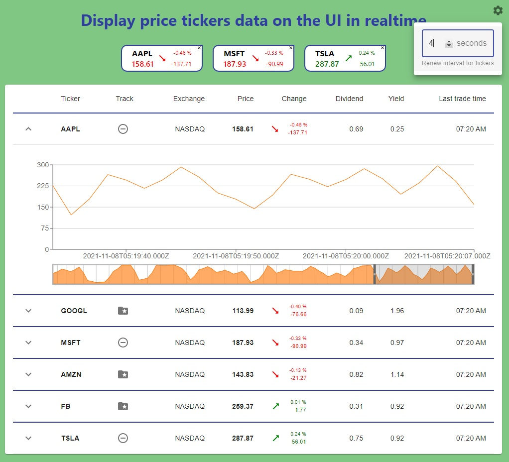

# It displays price tickers data (random) on the UI in realtime

## Changes

### Backend:
- splited functionality on separate files
- prise changes counts on previous data basis
- accepts interval time from client

### Frontend
- added visual effects to highlight positive or negative changes in the prices (arrows change color and direction, numbers rotate and change color)
- user can add/remove tickers from showing in Display (every row in TickersTable has add/remove button in _Track_ column, also every Ticker in Display has close button)
- added prices charts (expand buttons in the TickersTable first column toggle showing/hiding charts)
- settings allow user to specify prices renew interval
- added reducers tests



### The following technologies were used:
- React with hooks
- Redux (@reduxjs/toolkit && react-redux)
- Socket.io 
- Material-UI
- Recharts
- Jest

## Running the local service
1. Open a new bash shell
2. ```cd server```
3. ```npm install``` or ```yarn install```
4. ```npm run start``` or ```yarn start```
5. You can visit [http://localhost:4000](http://localhost:4000) to check that the service is working correctly and inspect the data it produces.

## Run your application
1. Open a new bash shell
2. ```cd client```
3. ```npm install``` or ```yarn install```
4. ```npm run start``` or ```yarn start```

## Run the tests
1. Open a new bash shell
2. ```cd client```
3. ```npm run test``` or ```yarn test```

# Price Service Usage

URL:
```http://localhost:4000```

Price tickers are real-time via web-sockets.
